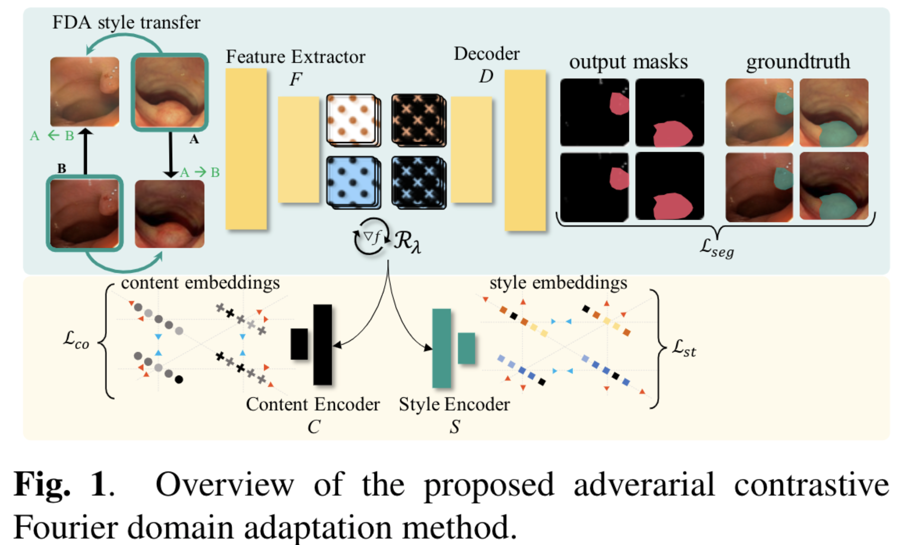
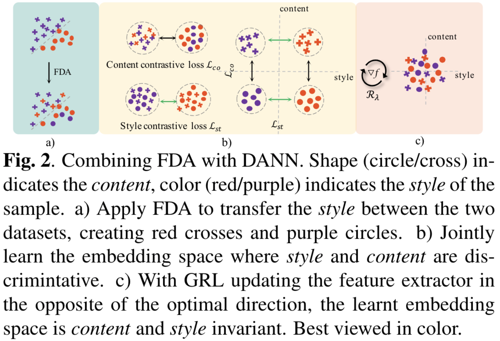
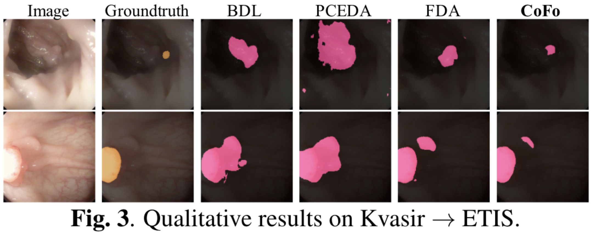
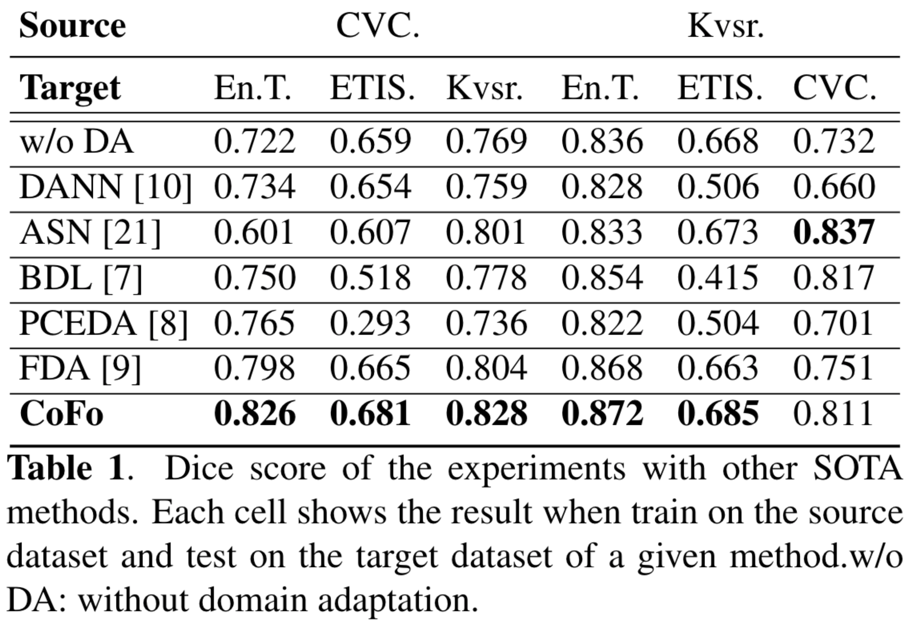
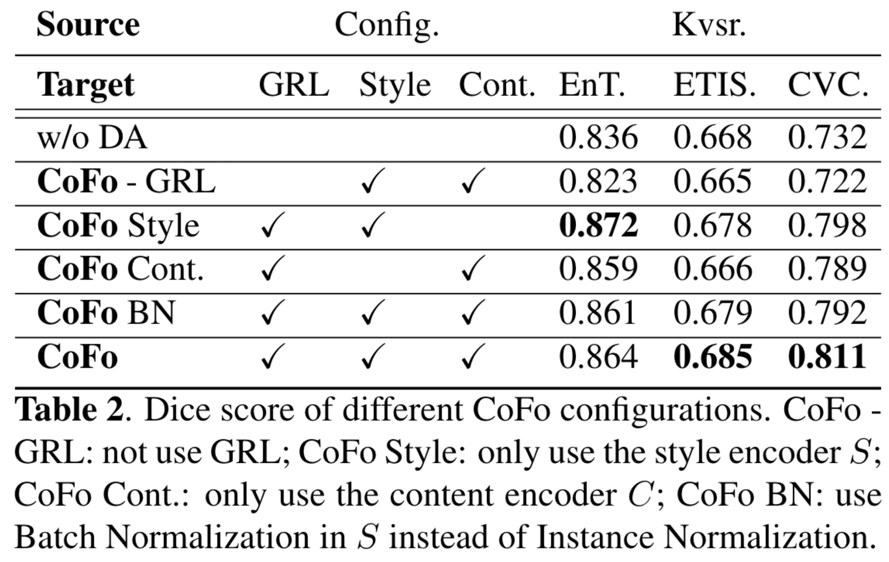

# Adversarial Contrastive Fourier Domain Adaptation for Polyps Segmentation
Official implementation of the paper. Accepted as ISBI2022.

# Abstract
Due to the shortage of experienced endoscopists, Computer-Aided Diagnosis (CAD) systems for colonoscopy have recently attracted many research interests.
There exist several public polyp segmentation datasets, giving way to the adoptions of domain adaptation methods to address the shift in distributions.
Current domain adaptation frameworks often comprise  (i) a domain discriminator trained with an adversarial loss and (ii) an image-translation network.
Due to the complexity of image-translation networks, such methods are generally hard to train to achieve satisfactory results.
Hence, we propose a domain adaptation method that leverages Fourier transform as a simple alternative to the image-translation network.
We introduce an adversarial contrastive training strategy to jointly learn an embedding space that considers both *style* and *content* of the sample.
Our method demonstrated consistent gains over state-of-the-arts
on polyp semantic segmentation task for four public datasets.

# Method

# Results

# Usage
1. The data splits is in `data/csv/`. You can download the original images at their websites and put it in `data/images`.
2. Check 3 notebooks file in this repo to train for **baseline**, **FDA** and **CoFo**. I tried to keep the code modular and self-explantory.
3. Pretrained weights can be found [here](https://drive.google.com/drive/folders/1CkyWKRyuFsWrP4F6wTlY10WQyWqOPWzy?usp=sharing).